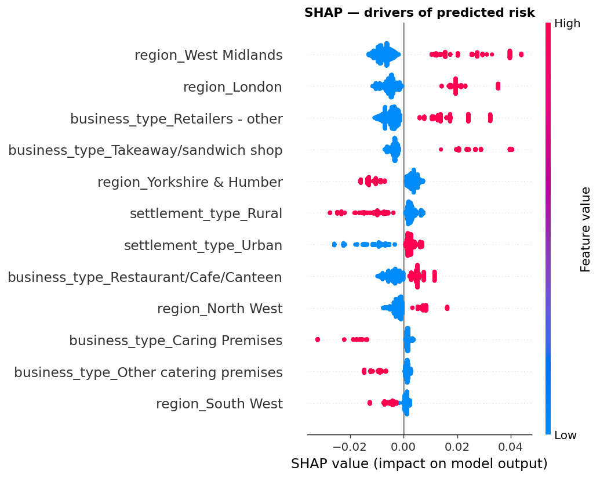
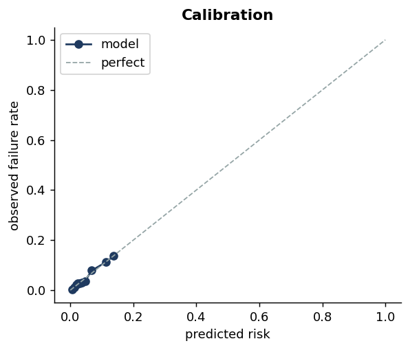

# 🍽️ Food hygiene risk screener

A deployed machine-learning web app that estimates the probability a UK food business
would receive a **poor hygiene rating (FHRS 0–2)** — from characteristics known *before*
any inspection: business type, region, and urban/rural setting.

> **Live demo:** coming soon ·
> **Sibling project:** the statistical analysis behind this model lives in
> [`fsa-hygiene`](https://github.com/abasukanga4/fsa-hygiene) (the "why"; this repo is the "predict & ship").



---

## What it is

Project 1 *explained* why food businesses fail inspections. This is the productised
counterpart: a live tool a user can open in a browser, enter a business's details, and get
back a **calibrated risk estimate** with the factors driving it. It's the "I can ship a
model, not just write a notebook" piece.

## The model, honestly

| | |
|---|---|
| **Task** | Binary classification — `needs_improvement` (rating ≤ 2), a ~4.5% positive class |
| **Model** | RandomForest in a scikit-learn `Pipeline` (one-hot → forest) |
| **Features** | Business type · region · urban/rural — *only what's knowable up front* |
| **ROC-AUC** | **0.737** (test) — useful screening signal from structure alone |
| **PR-AUC** | 0.104 (vs 0.045 base rate — ~2.3× better than random) |
| **Brier** | 0.042 — **well calibrated** (see below) |
| **Explainability** | SHAP values, global and per-prediction |

**Two decisions that matter** (and that I'd talk through in an interview):

1. **I excluded inspection recency.** It's a *strong* predictor (AUC jumps to 0.83 with it)
   — but only through **reverse causation**: failing businesses get re-inspected sooner, so
   "recent inspection" correlates with failure. A prospective business has no history, so
   including it would be both leaky and useless in deployment. Dropping it costs accuracy and
   buys integrity. This is the predictive-world cousin of the data-leakage call in Project 1.

2. **I did *not* class-balance the model.** Balancing inflates every probability toward 50%,
   which would make the app's "risk %" meaningless. Leaving it off keeps `predict_proba`
   **calibrated to the true ~4.5% base rate**, so a displayed "10%" really means ~10%.
   Imbalance is handled at *scoring time* via the operating threshold instead.



At a screening threshold (flag every business scoring above the 4.5% average) the model
**catches ~70% of true failures** — the right trade-off for prioritising limited inspections.

## Run it locally

```bash
python -m venv .venv && source .venv/bin/activate
pip install -r requirements.txt

python src/prepare_data.py     # pull FSA data -> data/processed/
python src/train_model.py      # train, evaluate, save model + figures
streamlit run app.py           # open the app
```

## Deploy it (Hugging Face Spaces — free)

1. Create a new **Streamlit** Space at huggingface.co/spaces.
2. Push this repo to it (the trained `model/model.joblib` is committed, so the Space needs no
   training step — it loads the model and runs).
3. Spaces installs `requirements.txt` and runs `app.py` automatically. Paste the resulting URL
   into the "Live demo" line above.

## Repo layout

```
hygiene-risk-app/
├── app.py                 # the Streamlit app  ← the product
├── src/
│   ├── prepare_data.py    # FSA API -> model table
│   └── train_model.py     # train, evaluate honestly, save model + figures
├── model/model.joblib     # trained pipeline + metadata (committed; the app loads it)
├── figures/               # ROC, PR, calibration, importance, SHAP
└── requirements.txt
```

## Limitations

- A **screening aid, not a verdict.** Type + location explain only part of risk; most of why a
  *specific* business fails is specific to it (unmeasured: management, premises age, footfall).
- **18 local authorities**, chosen for regional/urban-rural spread, not the full UK.
- Predictions describe *associations* in historical data, not guarantees about any one business.

## Tech

Python · scikit-learn · SHAP · Streamlit · pandas · matplotlib · joblib

---

*Data © Crown copyright, Food Standards Agency (FSA open API). Built by Abas Ukanga — for demonstration, not regulatory use.*
